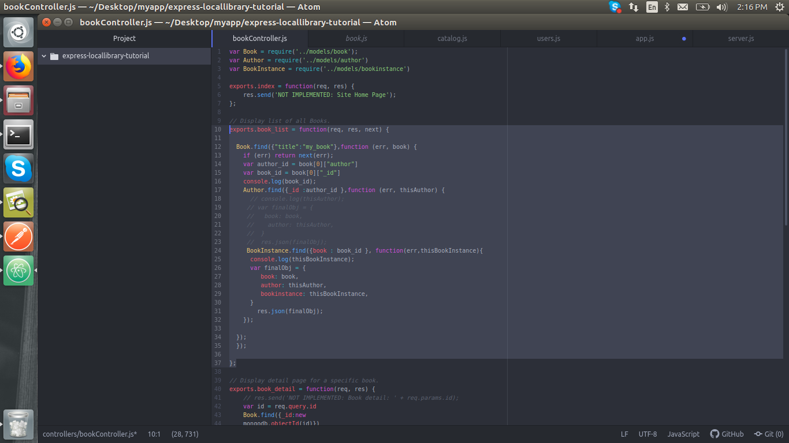
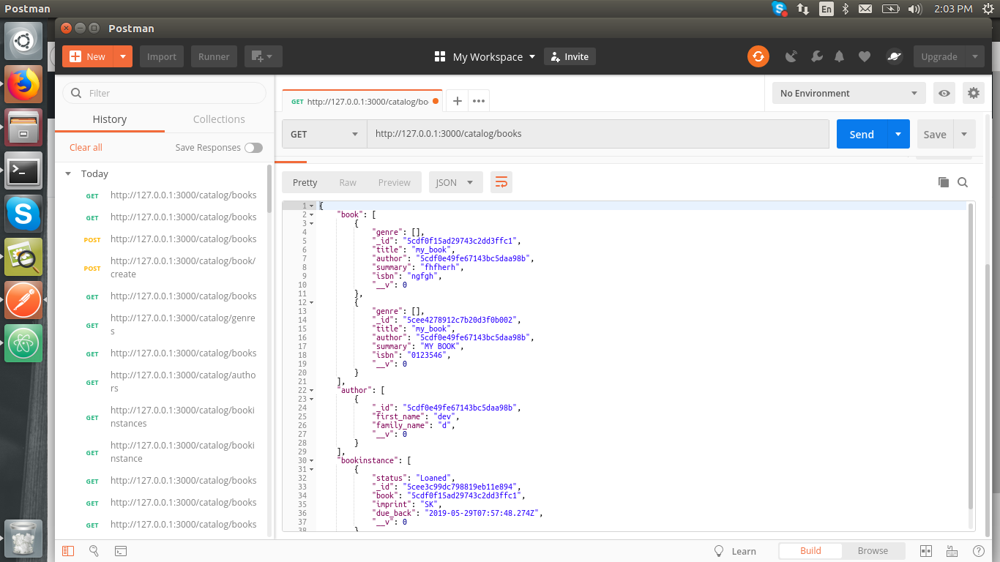

# callbacks-node

- Models (author, book, bookinstance, genre)

purpose - Using 3 tables (author,book,bookinstance) one after one in call back function

- Run npm install
- Run nodemon

- Run http://127.0.0.1:3000/catalog/books in postman

